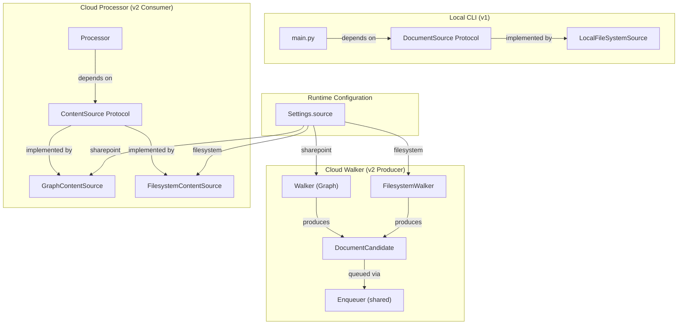

# Document Sources and Pluggable Seams

The system decouples document enumeration and content retrieval from concrete implementations through two pluggable protocols: **`DocumentSource`** (how files are discovered) and **`ContentSource`** (how file bytes are retrieved). This seam design unifies the local CLI's single-machine batch flow with the cloud pipeline's distributed walker/processor jobs, and makes adding new sources—SharePoint, OneDrive, S3, local NAS—a matter of implementing two interfaces.

## Overview: Two Protocols, Three Implementations

The abstraction boundary spans two dimensions:

1. **Discovery** — how the system learns about files to classify
   - **`DocumentSource` protocol** (v1 CLI): yields `Path` objects to classify
   - **Local implementation** (`LocalFileSystemSource`): walks a local directory recursively
   - **Cloud producer** (`Walker` / `FilesystemWalker`): custom per-source logic feeding an `Enqueuer`

2. **Retrieval** — how the processor obtains bytes and re-validates content identity
   - **`ContentSource` protocol** (v2 processor): `fetch_content_hash(message)` + `download(message)`
   - **Graph implementation** (`GraphContentSource`): calls `GraphClient` for SharePoint
   - **Filesystem implementation** (`FilesystemContentSource`): reads from mounted disk

At configuration time (`CLASSIFIER_SOURCE=sharepoint|filesystem`), the correct implementation is wired in; the classifier code never branches on the source.

## Architecture Diagram



The diagram shows how `CLASSIFIER_SOURCE` at runtime selects which implementations wire into the core classification logic.

## `DocumentSource` Protocol — CLI-Era Abstraction (v1)

**Location:** `src/sources.py`

The `DocumentSource` protocol is the v1 CLI's contract for discovering files. It has one method:

```python
class DocumentSource(Protocol):
    """A source of document paths to classify."""
    def documents(self) -> Iterable[Path]: ...
```

### `LocalFileSystemSource` Implementation

The only current implementation of `DocumentSource`:

- **Enumeration**: walks a local file or directory recursively
- **Sorting**: results are sorted for deterministic output
- **Supported filtering**: reuses `extraction.supported_suffixes()` (single source of truth)
- **Unsupported handling**: files without an extractor are logged as `WARNING` and skipped (never error)
- **Error handling**: missing/invalid paths raise `SourceError` (domain error, not `OSError`)

**Key design decision (ADR-0010):** "Supported" is *not* a static list in the sources module. Instead, it queries the extraction layer's registered `TextExtractor` suffixes, so adding a new format stays a one-place change in `extraction.py`.

**Example usage in CLI:**

```python
from sources import LocalFileSystemSource

source = LocalFileSystemSource(Path("/documents"))
for doc_path in source.documents():
    text = extract_text_from_path(doc_path)
    result = classify(text)
    write(result)
```

The CLI never knows whether files come from a local disk, a mapped network share, or (in future) an S3 bucket—it depends only on the `DocumentSource` protocol.

### Why v2 Doesn't Use `DocumentSource`

The cloud pipeline (walker/processor) does not use `DocumentSource` because:

1. **Producers are custom per source** — The Graph walker enumerates via delta pagination with resume tokens; the filesystem walker does full re-enumeration. Both are too different to unify under a simple `documents()` method.

2. **Producer output is richer** — Each producer yields a `DocumentCandidate` (drive_item_id, content_hash, mime_type, folder_path), not just a `Path`. That metadata is captured at enumeration time so the processor doesn't need to stat files.

3. **Idempotency is owned by a shared `Enqueuer`** — Rather than duplicate the new/changed/in-flight/pending enqueue decision logic across two producer implementations, both feed a single `Enqueuer` that makes all decisions identically (ADR-0020).

---

## `DocumentCandidate` & `Enqueuer` — Shared Producer Core (v2)

**Location:** `src/enqueuer.py`

The `Enqueuer` class is the source-neutral half of the cloud pipeline's producer side. It lives between the source-specific discovery (Graph pagination vs. filesystem walk) and the queue, implementing the idempotency contract once:

```python
@dataclass(frozen=True)
class DocumentCandidate:
    """One discovered file's source-neutral identity + metadata for enqueue decisions."""
    drive_item_id: str        # Graph item id OR root-relative path (locator)
    content_hash: str         # SHA-256 (filesystem) or quickXorHash (SharePoint)
    file_name: str | None
    mime_type: str | None
    folder_path: str | None
```

### Enqueue Decision Rules

The `Enqueuer` applies these rules to decide whether a candidate needs (re-)queuing:

1. **New file** → enqueue
2. **In flight** (status = `queued` or `processing`) → skip (no duplicate work)
3. **Pending reset** (status = `pending`, manual re-classification request) → enqueue
4. **Changed** (content_hash != stored hash) → enqueue and rotate old hash to `previous_hash`
5. **Unchanged** (hash matches) → skip
6. **Manual override present** → never touch the row (human decision preserved)

### Commit-Before-Enqueue Invariant

A critical ordering invariant (ADR-0020):

```
1. UPSERT documents row to queued status
2. COMMIT to database
3. Enqueue message to queue
```

Why? A queue send *cannot* be rolled back. If the enqueue fails after commit, the row is stuck as `queued` but the message never reached the queue—recoverable via a `pending` reset on the next walk. If we enqueued first and the commit failed, the message would be delivered but the row would not exist, causing a processor failure.

### `Walker` Uses `Enqueuer`

The Graph `Walker` class iterates delta pages, extracts `DocumentCandidate` from each `driveItem`, and hands it to the `Enqueuer`:

```python
def _process_item(self, sync: SyncState, item: dict) -> None:
    """Build a candidate and hand it to the shared enqueuer."""
    candidate = DocumentCandidate(
        drive_item_id=item["id"],
        content_hash=content_hash(item),  # Graph hash function
        file_name=item.get("name"),
        mime_type=_mime_type(item),
        folder_path=folder_path(item),
    )
    self._enqueuer.enqueue_if_needed(sync, self._drive_id, MessageSource.sharepoint, candidate)
```

The `Walker` owns:
- Delta pagination loop with time budget
- Resume/delta token persistence
- Parsing Graph's driveItem structure

The `Enqueuer` owns:
- Idempotency decision logic
- Database UPSERT
- Commit-before-enqueue ordering

### `FilesystemWalker` Also Uses `Enqueuer`

The filesystem producer (ADR-0020) implements the same enqueue pattern, but without tokens:

```python
def walk(self) -> WalkStatus:
    """Enumerate the root and enqueue each new/changed file."""
    sync = self._begin_walk()
    for path in LocalFileSystemSource(self._root).documents():
        candidate = self._candidate(path)
        self._enqueuer.enqueue_if_needed(
            sync, self._drive_id, MessageSource.filesystem, candidate
        )
    return self._complete(sync)
```

Key differences:
- **No time budget** — filesystem enumeration is fast; no need to resume
- **Full re-enumeration** — every run walks the entire root
- **No delta tokens** — `SyncState.delta_token` and `resume_token` stay `NULL`
- **Hash-based idempotency** — unchanged files' hashes match stored hashes and are skipped
- **Shared drive_id** — synthetic `filesystem:<root>` key in `SyncState`

Both producers run the *identical* enqueue decision logic via `Enqueuer`, so idempotency is byte-for-byte the same regardless of source.

---

## Message Wire Format and `MessageSource`

**Location:** `src/models.py`

The queue `Message` carries the identity a processor needs to download and classify:

```python
class Message(BaseModel):
    source: MessageSource = MessageSource.sharepoint  # "sharepoint" or "filesystem"
    document_id: int
    sync_state_id: int
    drive_id: str          # Graph drive id OR synthetic "filesystem:<root>"
    drive_item_id: str     # Graph item id OR root-relative POSIX path
    file_name: str
    mime_type: str
    content_hash: str
    enqueued_at: AwareDatetime
```

### `MessageSource` Discriminator

The `source` field self-describes the message origin:

- `MessageSource.sharepoint` — produced by `Walker`, expects `GraphContentSource`
- `MessageSource.filesystem` — produced by `FilesystemWalker`, expects `FilesystemContentSource`

**Why include it?** A misconfigured setup (messages from SharePoint on a queue, processor configured for filesystem) will fail fast with a clear error rather than silently misinterpreting a path as a Graph ID.

### `drive_item_id` as Universal Locator

The `drive_item_id` field is the source-neutral locator:

| Source | `drive_item_id` Value | Used By Processor |
|--------|----------------------|-------------------|
| SharePoint | Graph item ID (e.g., `"0AB123XYZ"`) | `GraphContentSource` passes to `GraphClient.download(drive_id, drive_item_id)` |
| Filesystem | Relative path in POSIX form (e.g., `"reports/Q4-2024/summary.pdf"`) | `FilesystemContentSource` resolves against mounted `root` |

Reusing `drive_item_id` (instead of adding a separate `path` field) avoids duplication and keeps the `(sync_state_id, drive_item_id)` UPSERT key source-neutral.

---

## `ContentSource` Protocol — Processor Retrieval Seam (v2)

**Location:** `src/content_source.py`

The processor decouples from concrete retrieval by depending on a narrow `ContentSource` protocol:

```python
class ContentSource(Protocol):
    """The processor's retrieval seam: current hash + bytes for one work item."""
    
    def fetch_content_hash(self, message: Message) -> str | None:
        """Return the file's current content hash, or None if not available."""
        ...
    
    def download(self, message: Message) -> bytes:
        """Return the file's raw bytes."""
        ...
```

The processor uses it in two places:

1. **Re-validation** — Check that the file's current hash matches the hash the walker enqueued; if not, skip and let the walker re-enqueue it next run
2. **Retrieval** — Download the bytes for extraction and classification

### `GraphContentSource` Implementation

Used when `CLASSIFIER_SOURCE=sharepoint`:

```python
class GraphContentSource:
    """Retrieval via Microsoft Graph — the SharePoint path."""
    
    def __init__(self, graph: GraphClient) -> None:
        self._graph = graph
    
    def fetch_content_hash(self, message: Message) -> str | None:
        return self._graph.fetch_content_hash(message.drive_id, message.drive_item_id)
    
    def download(self, message: Message) -> bytes:
        return self._graph.download(message.drive_id, message.drive_item_id)
```

Forwards directly to the existing `GraphClient` (ADR-0015, ADR-0017).

### `FilesystemContentSource` Implementation

Used when `CLASSIFIER_SOURCE=filesystem` (ADR-0020):

```python
class FilesystemContentSource:
    """Retrieval from a mounted directory — the filesystem path."""
    
    def __init__(self, root: Path) -> None:
        self._root = root
    
    def fetch_content_hash(self, message: Message) -> str | None:
        return hash_bytes(self.download(message))
    
    def download(self, message: Message) -> bytes:
        path = self._resolve(message.drive_item_id)
        return path.read_bytes()
    
    def _resolve(self, locator: str) -> Path:
        """Resolve a root-relative locator to an in-root path, rejecting escapes."""
        candidate = Path(locator)
        if candidate.is_absolute():
            raise SourceError(f"Locator must be relative: {locator!r}")
        resolved = (self._root / candidate).resolve()
        root = self._root.resolve()
        if resolved != root and root not in resolved.parents:
            raise SourceError(f"Locator escapes the mount root: {locator!r}")
        return resolved
```

Key points:

- **Relative path resolution** — `message.drive_item_id` is a relative path; it is resolved against the configured `root`
- **Escape rejection** — symlinks and `..` paths that escape the root raise `SourceError` (never silently read outside the mount)
- **Consistent hashing** — `fetch_content_hash()` re-reads the file and hashes it with `hash_bytes()` (the same function the walker used to enqueue it), so the re-check hash is always comparable

### Hash Invariant

A shared `hash_bytes()` function ensures producer and processor agree on content identity:

```python
def hash_bytes(data: bytes) -> str:
    """Return the sha256 hex digest of data — the filesystem content hash."""
    return hashlib.sha256(data).hexdigest()
```

- **Walker** (enqueue time): reads file, calls `hash_bytes()`, stores hash in `DocumentCandidate`
- **Processor** (re-check): reads same file, calls same `hash_bytes()` function, compares
- **Contract**: identical hashes = file unchanged; mismatch = skip and let walker re-enqueue next run

---

## Processor's Retrieval Flow

**Location:** `src/processor.py`

The processor orchestrates retrieval per message:

```python
class Processor:
    def __init__(
        self,
        session: Session,
        source: ContentSource,  # Injected; either Graph or Filesystem impl
        queue: MessageQueue,
        voter: SelfConsistencyClassifier,
        writer: Writer,
    ) -> None:
        self._source = source
        # ...
    
    def _run_pipeline(self, document: Document, message: Message, received: ReceivedMessage) -> None:
        """Re-check hash, download, extract, classify."""
        try:
            # 1. Re-validate content hash
            current_hash = self._source.fetch_content_hash(message)
            if current_hash != message.content_hash:
                self._record_skipped(document, received, "content_hash mismatch; walker will re-enqueue")
                return
            
            # 2. Download bytes
            data = self._source.download(message)
            
            # 3. Extract text
            text = extract_text_from_bytes(data, message.mime_type)
            
            # 4. Classify
            verdict = self._voter.classify(text)
        except (GraphError, SourceError, ExtractionError, ClassificationError) as err:
            self._record_failure(document, received, err)
            raise
        
        # 5. Persist result
        self._record_success(document, message, received, verdict)
```

The processor *never* calls `GraphClient` or `Path.read_bytes()` directly. It calls methods on the injected `ContentSource`, which is swapped at startup based on `CLASSIFIER_SOURCE`.

---

## Configuration: Wiring at Runtime

**Location:** `src/config.py`

The `Settings` singleton exposes a `source` field:

```python
class Settings(BaseSettings):
    source: Source = Field(
        default="sharepoint",
        validation_alias="CLASSIFIER_SOURCE"
    )
    
    graph: GraphSettings | None = Field(default_factory=...)
    filesystem: FilesystemSettings | None = Field(default_factory=...)
```

Supported values: `"sharepoint"` (default) or `"filesystem"`.

### Filesystem Settings

When `CLASSIFIER_SOURCE=filesystem`, the `FilesystemSettings` section must be configured:

```bash
CLASSIFIER_SOURCE=filesystem
CLASSIFIER__FILESYSTEM_ROOT=/data/documents
```

The `root` path is where:
- The filesystem walker enumerates documents
- The processor resolves relative `drive_item_id` paths from queue messages

### Walker Wiring (producer selection)

**Location:** `src/walker.py`, `run()` function

```python
def run(settings: Settings) -> int:
    """Wire and run the correct producer based on CLASSIFIER_SOURCE."""
    if settings.source == "filesystem":
        if settings.filesystem is None or not settings.filesystem.is_configured:
            raise ValueError("CLASSIFIER_SOURCE=filesystem but FilesystemSettings not configured")
        producer = FilesystemWalker(session, queue, settings.filesystem.root)
    else:  # "sharepoint"
        producer = Walker(session, graph, queue, walk_request)
    
    status = producer.walk()
    return 0 if status == WalkStatus.completed else 1
```

### Processor Wiring (retrieval seam selection)

**Location:** `src/processor.py`, `run()` function

```python
def run(settings: Settings) -> int:
    """Wire and run the correct retrieval seam based on CLASSIFIER_SOURCE."""
    if settings.source == "filesystem":
        if settings.filesystem is None or not settings.filesystem.is_configured:
            raise ValueError("CLASSIFIER_SOURCE=filesystem but FilesystemSettings not configured")
        source = FilesystemContentSource(settings.filesystem.root)
    else:  # "sharepoint"
        graph = create_graph_client(settings)
        source = GraphContentSource(graph)
    
    processor = Processor(session, source, queue, voter, writer)
    processor.run_once()
    return 0
```

Once wired, the `Processor` calls `source.fetch_content_hash()` and `source.download()` without knowing or caring which implementation is injected.

---

## Data Model Schema: Source-Agnostic Columns

**ADR-0020** reuses the existing `SyncState` and `Document` tables for both sources, by treating Graph-specific column names as source-neutral:

| Table | Column | SharePoint Value | Filesystem Value |
|-------|--------|------------------|------------------|
| `SyncState` | `drive_id` (UNIQUE) | Graph drive ID (e.g., `"b!abc123..."`) | Synthetic key: `filesystem:/data/documents` |
| `SyncState` | `delta_token` | Graph `@odata.deltaLink` | `NULL` (no delta feed) |
| `SyncState` | `resume_token` | Graph `@odata.nextLink` | `NULL` (no pagination) |
| `Document` | `drive_item_id` | Graph item ID (e.g., `"0AB123XYZ"`) | Relative path in POSIX form (e.g., `reports/Q4.pdf`) |
| `Document` | `content_hash` | `quickXorHash` or SHA-1 | SHA-256 hex digest |
| `Document` | `mime_type` | From `file.mimeType` | Derived from file suffix |
| `Document` | `folder_path` | From `parentReference.path` | Parent directory relative to root |

The UNIQUE constraint `(sync_state_id, drive_item_id)` works unchanged because:
- For SharePoint, the Graph item ID is stable within a drive
- For filesystem, the relative path is stable across walks

---

## Full Request Lifecycle: Filesystem Source Example

To see how all the seams wire together:

1. **Configuration**
   ```bash
   CLASSIFIER_SOURCE=filesystem
   CLASSIFIER__FILESYSTEM_ROOT=/mnt/documents
   CLASSIFIER_PROVIDER=anthropic
   ANTHROPIC_API_KEY=sk-ant-...
   ```

2. **Walker enumerates** (produces)
   - `FilesystemWalker` starts with `root=/mnt/documents`
   - `LocalFileSystemSource` walks and yields `Path` objects (sorted, filtered for supported suffixes)
   - For each file, `FilesystemWalker._candidate()` builds:
     ```
     DocumentCandidate(
         drive_item_id="2024-Q4/report.pdf",  # relative to /mnt/documents
         content_hash="abc123...",             # sha256 of bytes
         mime_type="application/pdf",
         file_name="report.pdf",
         folder_path="2024-Q4",
     )
     ```
   - `Enqueuer.enqueue_if_needed()` checks idempotency rules and enqueues:
     ```
     Message(
         source=MessageSource.filesystem,
         drive_item_id="2024-Q4/report.pdf",
         content_hash="abc123...",
         ...
     )
     ```

3. **Message queued** (at-least-once)

4. **Processor dequeues** (consumes)
   - Receives `Message` with `source=filesystem`
   - Loads document row from DB
   - Calls `FilesystemContentSource.fetch_content_hash(message)`
     - Resolves `"2024-Q4/report.pdf"` relative to `/mnt/documents` → `/mnt/documents/2024-Q4/report.pdf`
     - Reads file, calls `hash_bytes()` → `"abc123..."` (matches!)
   - Calls `FilesystemContentSource.download(message)`
     - Returns file bytes
   - Extracts text, classifies, writes result to DB
   - Deletes message from queue

5. **On hash mismatch**
   - `FilesystemContentSource.fetch_content_hash()` returns new hash (file changed)
   - Processor skips with reason `"content_hash mismatch; walker will re-enqueue"`
   - Message stays on queue, visible timeout expires, redelivered
   - Next walker run sees the changed hash, re-enqueues

---

## Extension: Adding a New Source

To add a new source (e.g., S3), implement:

1. **`DocumentCandidate` producer**
   - Enumerate buckets/keys
   - Implement the custom walk logic (fetching, pagination, resumability, etc.)
   - Delegate to `Enqueuer` for idempotency
   - Store a synthetic `drive_id` in `SyncState` (e.g., `"s3:my-bucket"`)

2. **`ContentSource` implementation**
   ```python
   class S3ContentSource:
       def fetch_content_hash(self, message: Message) -> str | None:
           # Query S3 object metadata for ETag hash
           ...
       def download(self, message: Message) -> bytes:
           # Get object bytes from S3
           ...
   ```

3. **Configuration**
   - Add an `S3Settings` section (bucket, region, credentials)
   - Add `S3ContentSource` to config wiring

4. **Message `source` discriminator**
   - Add `MessageSource.s3` enum value
   - Update message dispatch logic

The classification pipeline (extraction, text processing, self-consistency voting, result persistence) requires *zero* changes.

---

## Related ADRs

- **ADR-0010** — Uniform `DocumentSource` abstraction (v1 CLI, single-source protocol)
- **ADR-0012** — Cloud two-job pipeline (walker/queue/processor decoupling)
- **ADR-0014** — SharePoint delta walker (resumable, idempotent enumeration)
- **ADR-0015** — Graph-authenticated download (SharePoint retrieval)
- **ADR-0017** — Graph content hash field (using `quickXorHash`)
- **ADR-0019** — Config-driven walk scope (scoping at Graph delta level)
- **ADR-0020** — Local-filesystem source for v2 pipeline (two producers, two retrieval implementations)
